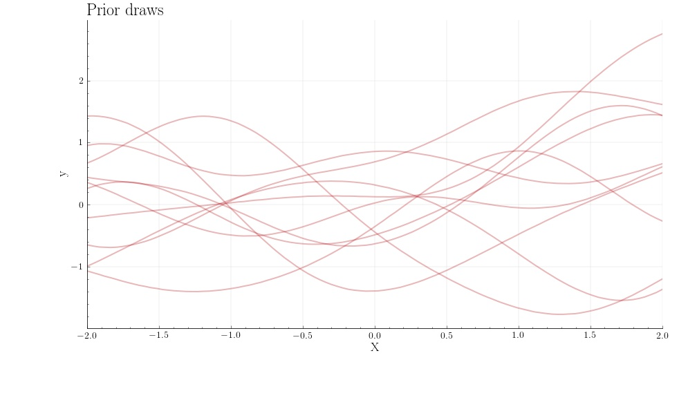

# GPViz: Visualizing Gaussian processes

[](https://codecov.io/gh/thomaspinder/GPViz)
[](https://gpviz.readthedocs.io/en/latest/?badge=latest)

GPViz is an extension library to [GPJax](https://github.com/thomaspinder/GPJax) that facilitates fast and informative plotting of Gaussian processes and kernels.

All plots can be generated by simply calling the `plot()` command on the relevant Gaussian process object, a dataset, Jax PRNGKey, and a parameter set. For a full introduction, see the [demo notebook here](https://gpviz.readthedocs.io/en/latest/nbs/demo.html).

## Gallery

### Prior



### Posteriors


### Kernels


## Installation

GPViz is available on [PyPi](https://pypi.org/project/GPViz/) and can be installed through
```shell
pip install gpviz
```